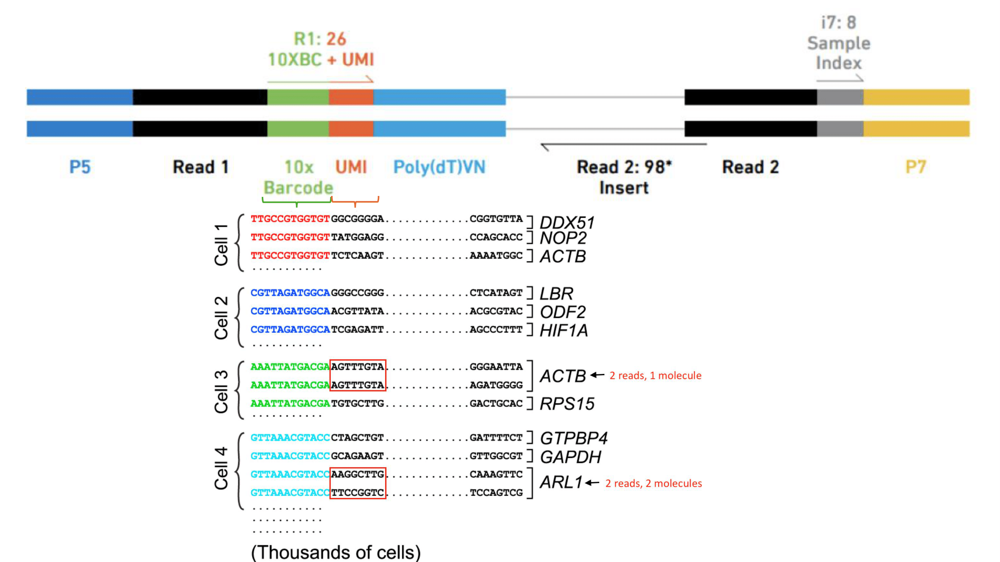
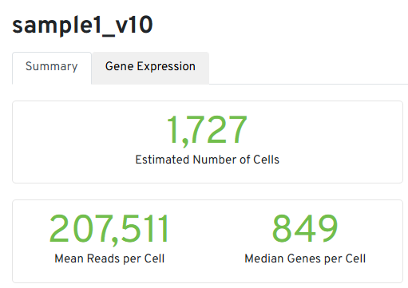
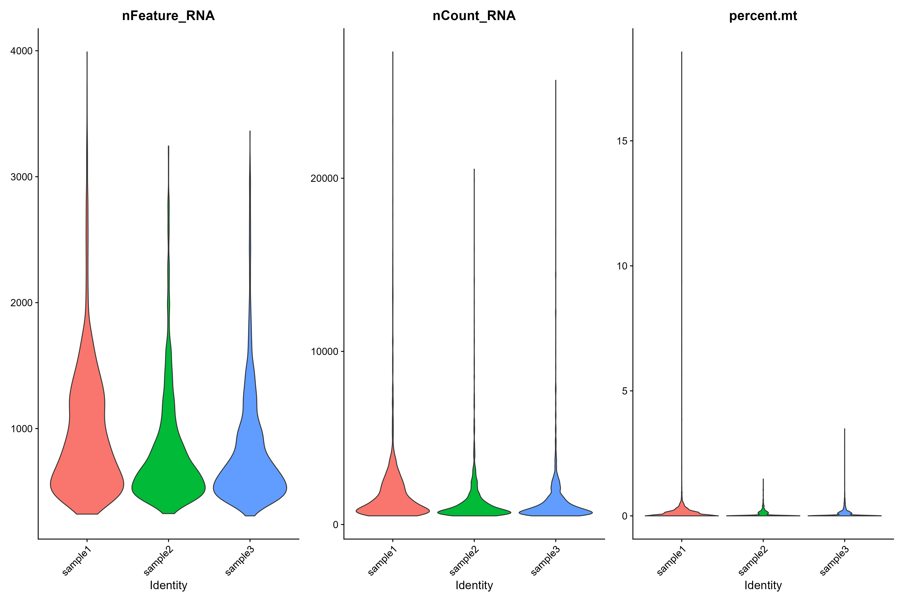
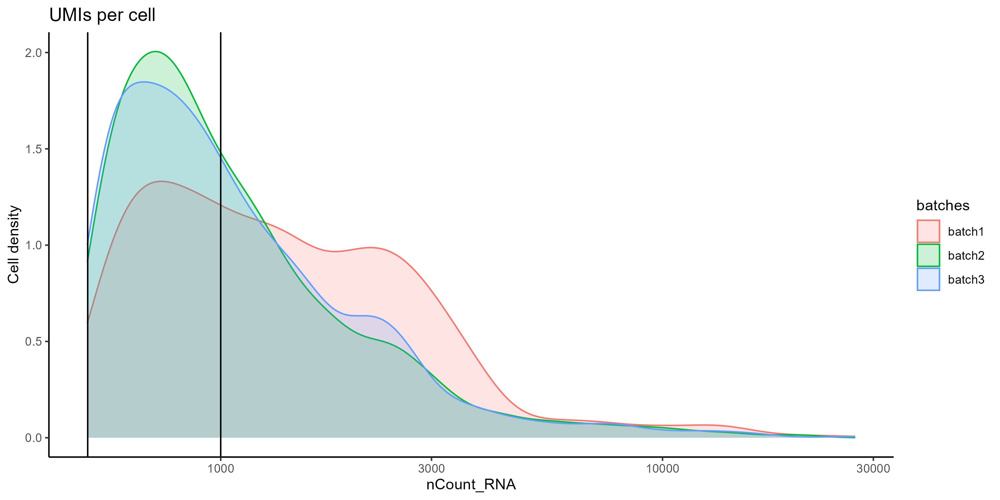
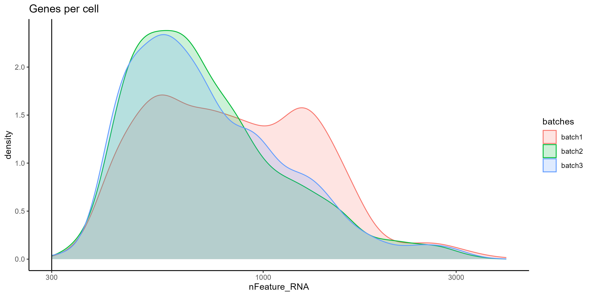
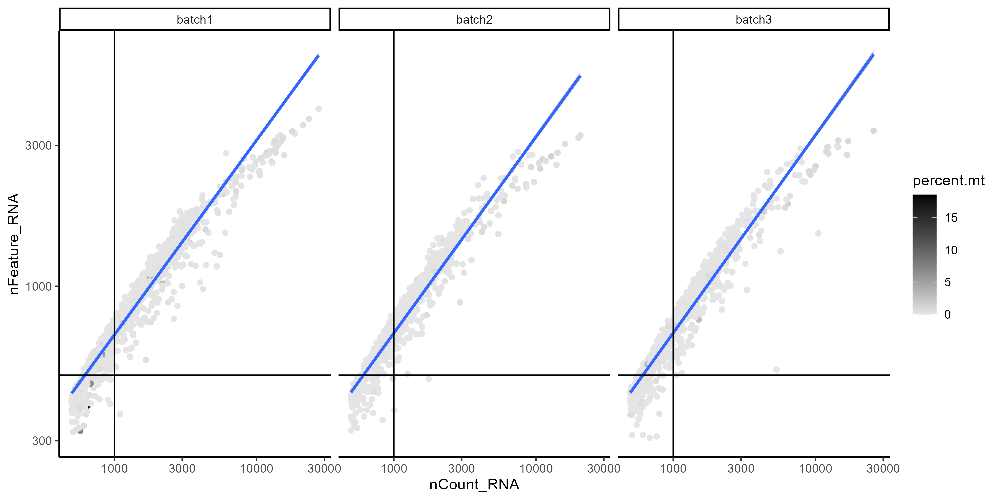
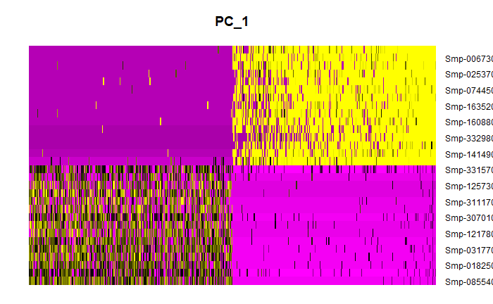
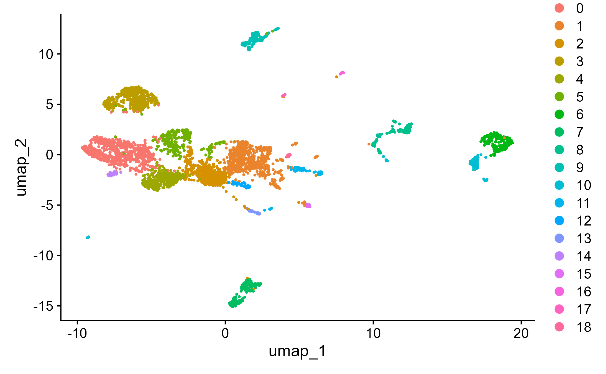
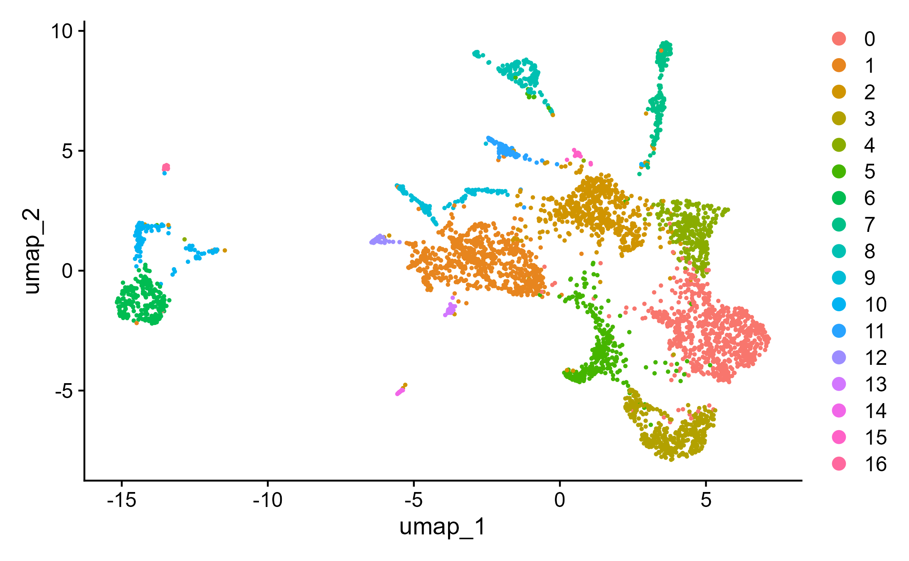
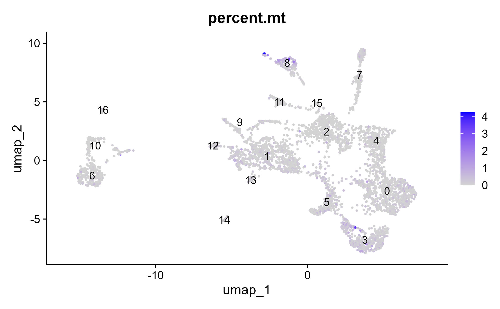

# Single-cell transcriptomics
## Author: T Attenborough 
## Affiliation: University of Glasgow


## Table of Contents
1. [Overview and Aims](#intro)
2. [Introduction to single cell transcriptomics](#basic)
3. [Working with Seurat objects](#seurat)
4. [Doublet cells removal](#doubletremoval)
5. [QC removal](#QCremoval)
6. [Normalizing and Scaling the data](#N&S)
7. [SCTransform of data](#SCTrasform)

8. [Exploring gene expression using gene plots and heatmaps](#plots)
9. [Functional analysis using GO term enrichment](#go)

---

## Overview and Aims <a name="intro"></a>

In this module, we will cover some basic concepts in single-cell transcriptomics. In the example we will use data of the somule stage from _Schistosoma mansoni_. We will start examining the data structure of counts per sample, filter low quality cells 


---

[ **Back to top**](#top)

## Introduction to single cell transcriptomics <a name="basic"></a>

Single-cell RNA sequencing (scRNA-seq) technology has become the state-of-the-art approach for unravelling the heterogeneity and complexity of RNA transcripts within individual cells, as well as revealing the composition of different cell types and functions within highly organized tissues/organs/organims. scRNA-seq allows the analysis of individual cells, revealing subtle differences in gene expression that might be masked in bulk sequencing, potentially identifying rare cell populations. However scRNA-seq can be expensive and complex to set up and performa, limiting its widespread adoption. 

The scRNA-seq data used in the module was obtained from 2 day schistosomula of _S.mansoni_ after _in vitro_ transformation of cercariae. Single-cells were obtained after tissue dissociation with a digestion solution. Single-cell concentration was estimated by flow-cytometry and loaded according to the 10X Chromium Single Cell 3' Reagent Kits v2 protocol. Library construction was done using standar protocols and sequenced on an Illumina HiSeq4000 (PE reads 75 bp) [reference](https://www.nature.com/articles/s41467-020-20092-5). For these tutorial, scRNA-seq data were mapped to the reference genome V10 using Cell Ranger (version 7.0.1)
 [here](https://www.10xgenomics.com/support/software/cell-ranger/latest)

---

## Working with Seurat objects <a name="seurat"></a>

After sequencing, reads are mapped to the reference genome with Cell Ranger, a set of analysis pipelines that process Chromium Next GEM single cell data to align reads and generate feature-barcode matrices. To do this, transcripts from different cells are identified through a 10X barcode, while different transcripts of each cell are identified through a unique molecular identifier or UMI.

  
**Figure 1.** A set of barcodes are used to identify different transcripts and cells.

Navigate to the output folder of Cell Ranger, within each sample folder you will find a web_summary of the run and a feature-barcode folder containing the feature-barcode_matrix. Inspect each web_summary. 

_Three key metrics are presented at the top left of the Summary tab:

*Estimated Number of Cells: the number of barcodes associated with cells.
*Mean Reads per Cell: the total number of sequenced reads divided by the number of cells. We recommend a minimum of 20,000 read pairs per cell.
*Median Genes per Cell: the median number of genes detected per cell-associated barcode. This metric is dependent on cell type and sequencing depth.


**Figure 2.** Main metrics of Cell Ranger run

We are not planning to go through the rest of the sections and metrics, for more details of each metrics and their expected range, please refer to the [10xGenomics_documentation](https://www.10xgenomics.com/analysis-guides/quality-assessment-using-the-cell-ranger-web-summary)

```R
# We will do the analysis in RStudio
# Set the route to the working directory that contains the folders with the Cell Ranger outputs for each sample

setwd("/set/your/path/here/")

```

We will use Seurat and other packages in this module. Seurat is an R package designed for QC, analysis, and exploration of single-cell RNA-seq data. Seurat aims to enable users to identify and interpret sources of heterogeneity from single-cell transcriptomic measurements, and to integrate diverse types of single-cell data.

The first step is to install the packages we are going to need for this script. Run the two below chunks to install the packages you'll need. You only need to install the packages once. This might take a few minutes as the libraries can be large. 

The first chunk sets up a function to check if packages are installed, install them if not and load them. The second chunk takes a list of the packages we'll need, and runs the function on them. After these two chunks, you should have loaded all the libraries you'll need.

```R
# function to check install and load packages
load_library <- function(pkg) {
  # check if package is installed
  new_package <- pkg[!(pkg %in% installed.packages()[, "Package"])]
  
  # install any new packages
  if (length(new_package)) 
    install.packages(new_package, dependencies = TRUE, Ncpus = 6)
  
  # sapply to loop through and load packages
  invisible(sapply(pkg, library, character.only = TRUE))
  
  # give message confirming load
  message("The following packages are now loaded")
  print(names(sessionInfo()$otherPkgs))
}
```

Now, load the packages that you'll use in the session.

```R
packages <- c('tidyverse', 'Seurat', 'RColorBrewer', 'patchwork', 'clustree', 'BiocParallel', 'SingleCellExperiment', 'scDblFinder')
load_library(packages)
```

Here we save an object that contains today's date, so we can save any files with the date automatically.

```R

st <- format(Sys.time(), "%Y-%m-%d") 

```
####Loading data

Next, we import the data files that contain the mapping outputs from Cellranger. There are three folders, from the three samples which were sequenced. Each folder contains the list of genes, the cell barcodes, and the count matrix showing the number of transcripts.

Since the we used 10X sequencing, we import this into R using the specific 10X import function.

```R

sample1.data <- Read10X('sample1/filtered_feature_bc_matrix/')
sample2.data <- Read10X('sample2/filtered_feature_bc_matrix/')
sample3.data <- Read10X('sample3/filtered_feature_bc_matrix/')

```

Lets see how the data looks like, dim() returns the number of rows and columns of a data.frame (df). Use head() and tail() to inspect of how the data actually looks like, here we are selecting the first 35 columns and the first or last 20 rows of the df. What do you see?

```R

dim(sample1.data)
head(sample1.data[,1:35],n=20L)
tail(sample1.data[,1:35],n=20L)

```

### Creating a Seurat object

Seurat is a widely used R package for single cell analysis. This function converts the matrix above into a 'Seurat object'. This allows you to perform a variety of analyses, and store metadata and analysis results all together.

Here you will filter out any cells with less than 300 genes detected, and any genes in less than 3 cell, to pre-filter out any really low quality cells and reduce noise. I'm also adding the information to each Seurat object of which sample it comes from.

```R

sample1 <- CreateSeuratObject(counts = sample1.data, project = "sample1", min.cells = 3, min.features = 300)
sample2 <- CreateSeuratObject(counts = sample2.data, project = "sample2", min.cells = 3, min.features = 300)
sample3 <- CreateSeuratObject(counts = sample3.data, project = "sample3", min.cells = 3, min.features = 300)

```

🚩 **Note the warning.** For _S.mansoni_, gene IDs are start with Smp and are linked to a six digit number by an underscore, e.g. Smp_349530. Seurat is not set up to accept underscores in gene names, so converts them to underscores, e.g. Smp-349530. This is important when linking our analysis back to the genome.

How do these look now?

```R

sample1

```
So here can see that there are 8,105 genes (of features) detected in this sample, and there are 1,724 cells.

You can also access the number of genes and cells of each sample

```R

dim(sample1)
dim(sample2)
dim(sample3)

```

Using the command head() and rownames() you also can access the genes in this objects, in this example you can see the first 20 genes.

```R

head(rownames(sample1),n=20)

```

You can access the first 20 cells with the commands head() and colnames() 

```R

head(colnames(sample1),n=20)

```

You can also access the metadata of the object, such as which sample this object came from.

```R

head(sample1@meta.data$orig.ident)

```
If you're not sure which metadata are available, or you want a summary of metadata in each category, that's an easy way to check. Anything that comes after the R object name and a dollar sign is a metadata value so you can look at it in a table as above, or in a UMAP, once you've generated one.

[ **Back to top**](#top)

## Doublet ID <a name="doubletremoval"></a>

Doublets, or multiplets, form when two or more cells are associated with one cell barcode - for example you might have a 'cell' in your data that looks like a hybrid of a muscle and a neural cell. Since these don't describe a cell type found in the sample, we want to exclude these cells as much as possible. There are many tools/strategies, the below tool assigns each cell a doublet score, and assigns cells as doublets or singlets based on these scores and the expected percentage of doublets. Run the following lines and set the function.

```R

Dblremove<-function(sample){
  sce <- as.SingleCellExperiment(sample,assay="RNA")
  #scDblFinder command uses a probabilist strategy to identify doublets. The set.seed() command will guarantee the same results everytime.
  set.seed(123)
  results<-scDblFinder(sce,returnType = 'table') %>%
    as.data.frame() %>%
    filter(type=='real')
  keep = results %>%
    dplyr::filter(class=="singlet") %>%
    rownames()
  sample=sample[, keep]

}

```

Run the doublet removal funtion in each sample

```R
sample1<-Dblremove(sample1)
sample2<-Dblremove(sample2)
sample3<-Dblremove(sample3)
```

Let's inspect the features and cell counts after doublet removal, how many cells were remove in each sample?

```R

dim(sample1)
dim(sample2)
dim(sample3)

```

### Merging samples

For today, we are going to combine all three of our samples simply, and run through an analysis of all three. Later on we'll be able to look at how similar the three samples are to each other. I usually will also run an analysis of each sample individually to make sure I understand the data, and the variability.

This creates one object that contains all three samples.

```R

day2somules <- merge(sample1, y = c(sample2, sample3), add.cell.ids = c("sample1", "sample2", "sample3"), project = "day2somules")
day2somules

```

Now there are 8,347 genes detected across this experiment, and there are 3,843 cells.

Can we still tell which cells came from which sample? Let's make sure by adding a metadata column to the combined Seurat object

```R

day2somules@meta.data$batches <- ifelse(grepl("2_", rownames(day2somules@meta.data)), "batch2", ifelse(grepl("3_", rownames(day2somules@meta.data)), "batch3", "batch1"))

```

How can you access the cell IDs in this object? How have these changed?

```R

head(colnames(day2somules))

```

Let's look at the metadata we've added

```R

table(day2somules@meta.data$batches)

```

[ **Back to top**](#top)

## QC removal <a name="QCremoval"></a>


### Mito % 

We commonly use % of mitochondrial transcripts to screen for dead/damaged cells - we want to exclude these kinds of cells. Thresholds of % mitochondrial reads vary, and for most non-model organisms there isn't an established threshold - the optimal threshold will also vary between tissue types.

This code chunk will calculate the percentage of transcripts mapping to mitochondrial genes: in _S.mansoni_ these genes start with 9.

```R

day2somules[["percent.mt"]] <- PercentageFeatureSet(day2somules, pattern = "Smp-9")

```

### Plot for QC

Now let's plot the cell density pre-QC by nFeature (genes), nCount (transcipts) and percentage of mitochondrial RNA for each sample. 

```R

VlnPlot(day2somules, features = c("nFeature_RNA", "nCount_RNA", "percent.mt"), ncol = 3,pt.size = 0)

```


**Figure 3.** Violin plots of each sample

It's important to consider multiple measurements when screening out low quality cells - especially when working on less well known organisms. So we generally plot metadata in several ways, and use the literature to decide what thresholds to use for QC filtering.

Here, we can extract the metadata for visualisation.

```R

day2somules_metadata <- day2somules@meta.data

```

Let's compare the number of UMIs (transcripts) per cell from the three samples at the same time with a density plot. What do you see? Compare this plot to the Violin plot in Figure 3.

```R

# Visualize the number UMIs/transcripts per cell. We want to have at least 500 UMIs/cell if possible. Black lines at 500 and 1000 UMIs
day2somules_metadata %>% 
  	ggplot(aes(color=batches, x=nCount_RNA, fill=batches)) + 
  	geom_density(alpha = 0.2) + 
  	scale_x_log10() + 
  	theme_classic() +
  	ylab("Cell density") +
  	geom_vline(xintercept = 500) +
  	geom_vline(xintercept = 1000)+
  	ggtitle("UMIs per cell")
ggsave(paste0("raw_umisPerCell_somules_v10_",st,".png"), width = 10, height = 5)

```


**Figure 4.** Density plot comparing the distibution of UMIs per cell between the samples. 


We also can plot the number of features (genes) per cell. Again, compare this plot to the Violin plot in Figure 3.

```R
# Visualize the distribution of genes detected per cell via histogram
day2somules_metadata %>% 
  	ggplot(aes(color=batches, x=nFeature_RNA, fill=batches)) + 
  	geom_density(alpha = 0.2) + 
  	theme_classic() +
  	scale_x_log10() + 
  	geom_vline(xintercept = 300)+
  	ggtitle("Genes per cell")
ggsave(paste0("raw_genesPerCell_somules_v10_",st,".png"), width = 10, height = 5)
```


**Figure 5.** Density plot comparing the distibution of Features per cell between the samples.

However all samples show a similar correlation when we compare the count of features (genes) and UMIs (transcripts), additionally we can color the cells by percentage of mitochondrial RNA to see the overall quality of the sample. Cells with low UMI and feature counts and high percentage of mitochondrial RNA could correspond to apoptotic cells and should be removed.


```R
day2somules_metadata %>% 
  	ggplot(aes(x=nCount_RNA, y=nFeature_RNA, color=percent.mt)) + 
  	geom_point() + 
	scale_colour_gradient(low = "gray90", high = "black") +
  	stat_smooth(method=lm) +
  	scale_x_log10() + 
  	scale_y_log10() + 
  	theme_classic() +
  	geom_vline(xintercept = 1000) +
  	geom_hline(yintercept = 500) +
  	facet_wrap(~batches)
ggsave(paste0("raw_cgenesVumis_mito_somules_v10_bybatch_",st,".png"), width = 10, height = 5)
```


**Figure 6.**

### QC filtering

Now let's proceed to filter-out low quality cell. We will only keep cells with more than 500 transcripts and less 5% mitochondrial RNA 

This is a fairly permissive filtering - we may find some more low quality clusters later in the analysis.

```R

#subsetting the dataset
day2somules <- subset(day2somules, subset = nCount_RNA > 500 & percent.mt < 5)
dim(day2somules) #shows number of genes and number of cells

```

How many cells were removed in total and by batch?

###Save and start next analysis

Now that you have completed the QC filter, you can save your analysis in a R object.  

```R

saveRDS(day2somules, file = "day2somules_v10_firstfilt.rds") #saves this version of the dataset

```

If you had any issues later on, you can import R object here.

```R

day2somules <- readRDS(file = "day2somules_v10_firstfilt.rds")

```

[ **Back to top**](#top)

## Normalisation and scaling <a name="N&S"></a>

On to the next stage of analysis: initial normalization and clustering

```R

day2somules <- NormalizeData(day2somules)
day2somules <- FindVariableFeatures(day2somules, selection.method = "vst", nfeatures = 2000)
# Identify the 10 most highly variable genes
top10 <- head(VariableFeatures(day2somules), 10)
top10

all.genes <- rownames(day2somules)
day2somules <- ScaleData(day2somules, features = all.genes)

```

### PCA

Now, we can look at look at gene expression scaled across the cells, and find variable features: genes.

Here, we perform PCA on the scaled data. The most variable features selected earlier are used.
```R
#shows top contributing features for the PCs
day2somules <- RunPCA(day2somules, features = VariableFeatures(object = day2somules),npcs = 100) 
#shows the weightings of top contributing features to pcs 1 and 2
VizDimLoadings(day2somules, dims = 1:2, reduction = "pca") 
```


**Figure 7.**

```R
#plots heatmap of top 500 most variable cells for PC1, with relative gene expression
DimHeatmap(day2somules, dims = 1, cells = 500, balanced = TRUE) 
```


**Figure 8.**

### Jackstraw

It's possible to use JackStraw to randomly permute data in 1% chunks. Here with 100 replicates and for 100 PCs. However, for these data it's too slow for this tutorial - on my computer it took approximately 28 minutes. 

An elbow plot is a quick way to assess the contribution of the principal components by percentage of variation.
```R
DefaultAssay(day2somules) <- "RNA"

#day2somules <- JackStraw(day2somules, num.replicate = 100, dims =100) #do the permutation
#day2somules <- ScoreJackStraw(day2somules, dims = 1:100) #extract the scores
#JackStrawPlot(day2somules, dims = 1:100) #plot the p-vals for PCs. Dashed line giives null distribution
#ggsave("day2somules_v10_jackstrawplot100.pdf", width = 30, height = 15, units = c('cm'))

ElbowPlot(day2somules, ndims = 100)  #ranks PCs by percentage of variation. A clear dropoff is sometimes seen, though not really here.
ggsave(paste0("day2somules_v10_elbowplot100_",st,".jpg"))
```


**Figure 9.**

### Find clusters

```R
#here construct k-nearest neighbors graph based on euclidean distance in PCA space, then refine edge weights based on Jaccard similarity. this takes the number of PCs previously determined as important (here 40 PCs_)
day2somules <- FindNeighbors(day2somules, dims = 1:40) 
#this iteratively groups cells using Louvain algorithm (default). Resolution sets the granularity. 0.4-1.2 gives good results for ~3K cells, with larger number suiting larger datasets.
day2somules <- FindClusters(day2somules, resolution = 0.5) 
#runs umap to visualise the clusters. Need to set the number of PCs
day2somules <- RunUMAP(day2somules, dims = 1:40) 
#visulaises the UMAP
DimPlot(day2somules, reduction = "umap") 
ggsave(paste0("day2somules_v10clust_40PC_0.4res_RNA_",st,".jpg"))
```


**Figure 10.** lo que quieras 

## SCTransform of data <a name="SCTrasform"></a>

Do a basic analysis to start with, using SCTransform. This function normalises and scales the data, and finds variable features. It has some improvements from earlier versions of Seurat (and replaces NormalizeData(), ScaleData(), and FindVariableFeatures()), though there are functions it's difficult to perform when the data is transformed with this method.
```R
# run sctransform
day2somules <- SCTransform(day2somules, verbose = TRUE)
```

The results of this are saved in a different 'assay' of the R object - so you can still use both, and the data aren't overwritten.

#PCA on SCT

Now, perform dimensionality reduction by PCA and UMAP embedding

Here, we perform PCA on the scaled data. The most variable features selected earlier are used. This follows the same approach as when using the RNA assay we used above.
```R
day2somules <- RunPCA(day2somules, features = VariableFeatures(object = day2somules), npcs=100)
VizDimLoadings(day2somules, dims = 1:2, reduction = "pca") #shows the weightings of top contributing features to PCs 1 and 2
DimHeatmap(day2somules, dims = 1, cells = 500, balanced = TRUE) #plots heatmap of top 500 most variable cells for PC1, with relative gene expression
```
#CLustering on SCT

```R
#here construct k-nearest neighbours graph based on euclidean distance in PCA space, then refine edge weights based on Jaccard similarity. this takes the number of PCs previously determined as important (here 40 PCs_)
day2somules <- FindNeighbors(day2somules, dims = 1:40) 
#this iteratively groups cells using Louvain algorithm (default). Resolution sets the granularity. 0.4-1.2 gives good results for ~3K cells, with larger number suiting larger datasets.
day2somules <- FindClusters(day2somules, resolution = 0.5) 
#runs umap to visualize the clusters. Need to set the number of PCs
day2somules <- RunUMAP(day2somules, dims = 1:40) 
#visualises the UMAP
DimPlot(day2somules, reduction = "umap") 
ggsave(paste0("day2somules_v10clust_40PC_0.4res_SCT",st,".jpg"))
```


**Figure 11.**

#Plot metadata

Now we have a UMAP representation of our cells, we can also use that to visualise the metadata.
```R
DimPlot(day2somules, reduction = "umap", group.by = "batches", shuffle = TRUE) #visualises the UMAP
ggsave("day2somules_v10_40PC_0.5res_after_one_filt_shuffled_batch_SCT.jpg")

```


**Figure 12.**

What do you notice once the UMAP is coloured by sample? Is there anything you might do about this?

```R
FeaturePlot(day2somules, features="percent.mt", label=TRUE)
ggsave("day2somules_v10_40PC_0.5res_after_one_filt_mt_SCT.jpg")
```


**Figure 13.**

What do you think about this figure? Is there any cluster with a higher proportion of MT RNA?


# Marker identification

We want to understand what the cell clusters might be. One approach to do that is find gene that are cluster markers - find differentially expressed genes that are descriptive of a cluster.

```R
DefaultAssay(day2somules) <- "RNA"

day2somules<-JoinLayers(day2somules)

#day2somules.all.markers_roc <- FindAllMarkers(day2somules, only.pos = TRUE, min.pct = 0.0, logfc.threshold = 0.0, test.use = "roc")

day2somules.markers_roc_cluster0 <- FindMarkers(day2somules, ident.1 = 0, only.pos = TRUE, min.pct = 0.0, logfc.threshold = 0.0, test.use = "roc")
```

Import annotation information. I have collected this from the genome annotation file. 
```R
v10_genelist <- read.csv("v10_genes_with_descriptions_2023-04-17.csv", stringsAsFactors = FALSE, header = TRUE) 
v10_genelist$X <- NULL 
```

We can combine these files to see the information associated with our marker genes.

```R
day2somules.markers_roc_cluster0$gene <- rownames(day2somules.markers_roc_cluster0)
day2somules.markers_roc_cluster0$gene <- gsub('\\-', '_', day2somules.markers_roc_cluster0$gene) #replace dashes in gene id with underscores

day2somules.markers_roc_cluster0 <- day2somules.markers_roc_cluster0 %>% left_join(v10_genelist, by = c("gene" = "Gene.stable.ID")) #check the top 5 marker genes are also in the somule paper
write.csv(x=day2somules.markers_roc_cluster0, file=paste0('day2somules.markers_roc_cluster0_annotate_', st, '.csv')) #save this as a csv
```

An exercise: in your pairs, choose a cluster, and use the FindMarkers function to find the markers, and then use the gene information to have a go at predicting the tissue type of the cell cluster.

```{r, error=TRUE}

#put your code in here!
day2somules.markers_roc_cluster_ <- FindMarkers()

```

A brainstorm question: how might you use this list to choose a gene to use for in-situ validation? What attributes might you be looking for?

How else might you classify cell cluster tissue types?


#Plot individual genes

Now we can look at gene expression in these data by gene. The example below shows you ago 2-1. As above, remove the hash symbol in front of the word ggsave and run this chunk of code if you want to save the plot. If you want to look at a different gene, simply type the gene ID where "Smp-179320" currently sits. Remember to use - rather than _ ! We can visualise genes that we already know something about in the organism, to see if that gives us some clues
```R
FeaturePlot(day2somules, features = "Smp-179320")
#ggsave(paste0("day2somules-Smp-179320-",st, ".jpg"), width = 25, height = 15)
```

We can also look at these genes with a violin plot - this visualisation can be helpful in many ways, including seeing which clusters a gene is most expressed in.
```R
VlnPlot(day2somules, features = "Smp-179320")
#ggsave(paste0("day2somules-Smp-179320_",st, ".jpg"), width = 25, height = 15)
```

Are there any genes you're particularly interested in? You can adapt the code below to see if, and where, it might be expressed in these data. If you're not sure, you can look up S mansoni on WBPS and choose a gene from there (https://parasite.wormbase.org/index.html). Remember to delete the # if you want to save the plot to your computer!
```R
FeaturePlot(day2somules, features = "your_gene")
#ggsave(paste0("day2somules-Smp-179320_",st,".jpg"), width = 25, height = 15)
```

You can also look for co-expression - are two genes you're interested in expressed in the same cells?
```R
coexpression.plot <-FeaturePlot(day2somules, features = c("Smp-179320", "Smp-086860"), blend = TRUE)
coexpression.plot
#ggsave(paste0("day2somules-coexpressed-Smp-179320-Smp-086860-",st, ".jpg"), width = 45, height = 25)
```

Can you find a pair genes whose products you might expect to interact, and see if they are co-expressed? Again, you can use WBPS to learn more about genes.

```{r}
#put your code in here!
```

#Cluster IDs

You want all the cluster names to be unique - why might that be?
```R
day2somules <- RenameIdents(object = day2somules, 
                               "0" = "my.cluster0",
                               "1" = "my.cluster1",
                               "2" = "my.cluster2",
                               "3" = "my.cluster3",
                               "4" = "my.cluster4",
                               "5" = "my.cluster5",
                               "6" = "my.cluster6",
                               "7" = "my.cluster7",
                               "8" = "my.cluster8",
                               "9" = "my.cluster9",
                               "10" = "my.cluster10",
                               "11" = "my.cluster11",
                               "12" = "my.cluster12",
                               "13" = "my.cluster13",
                               "14" = "my.cluster14",
                               "15" = "my.cluster15",
                            "16" = "my.cluster16")

day2somules[["my.cluster.names"]] <- Idents(object = day2somules)
```

Now we can make a plot of the clusters with the IDs that we've chosen, and make it a bit fancier with a custom colour palette.
```R
new_pal <- c("#c4b7cb","#007aaa","#ffb703","#c40c18","#fb8500","#7851a9","#00325b","#8ACB88","#107E7D", "#FB6376", "#57467B", "#FFFD82", "#2191FB", "#690500", "#B3E9C7", "#B57F50","#2C514C","grey")
scales::show_col(new_pal)
plot1 <- DimPlot(day2somules, reduction = "umap", label = FALSE, repel = TRUE, label.box = FALSE) + NoLegend() +scale_color_manual(values = new_pal)
LabelClusters(plot1, id = "ident", color = 'black', size =4, repel = T,  box.padding = 1.75, max.overlaps=Inf)

ggsave(paste0("day2somules-labelledlclusters_40PC_0.5res_",st,".jpg"), width = 25, height = 15)
```
